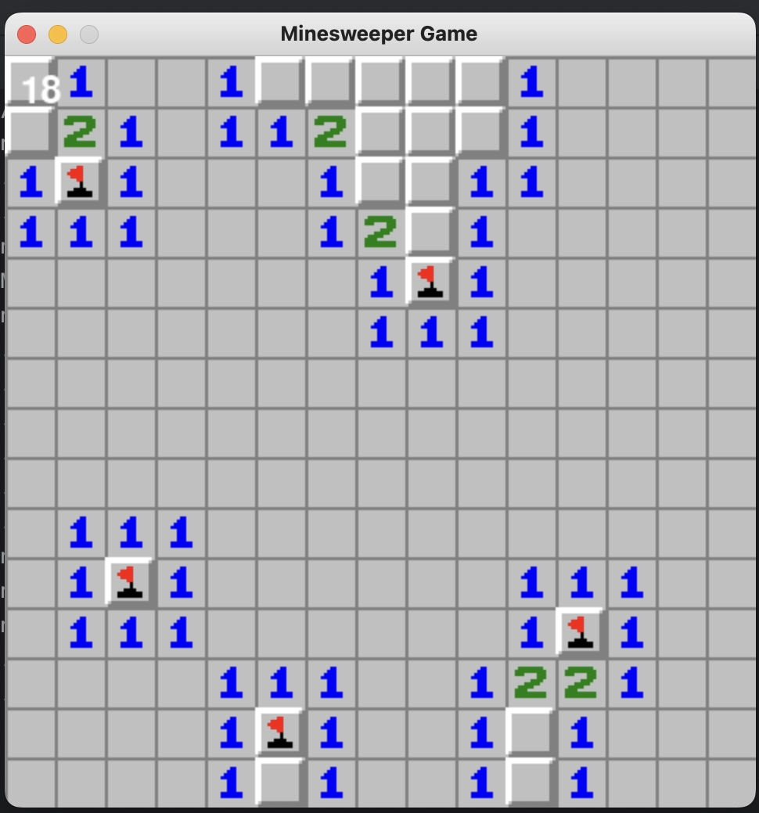

# MineSweeper

## Project Introduction:
- Our project implements the classic game of Minesweeper in Python. The goal is to uncover all cells without mines.

## Gameplay:
- The player starts by uncovering a cell. 
- If the cell contains a mine, the game ends.
- If the cell does not contain a mine, it displays a number indicating how many adjacent cells contain mines.
- The player uses the number clues on each block to infer which neighboring cells are safe to open.
- The player can place flags on cells they suspect contain mines to aid in deduction (right-click to place a flag, right-click again to unplace a flag)
- The game is won when all non-mine cells are uncovered and all mines are correctly flagged.

## Features
- **Safe First Click:** Ensures the first cell clicked is never a mine.
- **Recursive Uncovering:** Automatically uncovers adjacent cells when a safe cell is revealed.
- **Flagging Capability:** Players can flag cells they suspect contain mines.
- **Console-Based Interface:** Easy-to-use interface for game interaction.
- **Timer:** Tracks how long it takes to solve the board.

## Types of cell/tile:
1. Number/clue:
2. Mine: 
4. Flag: 
5. If player hits a mine, it explodes: 
6. If player mis-placed a flag, this will show up when player hits a mine and ends the game: 
7. Unknown/un-clicked tile:
8. Blank/background tile: 

## User Interface
Here shows the user interface of our game
<p align="center">
  
  <br>
  <em>Figure 1: Minesweeper Gameplay Screenshot</em>
</p>

When player wins:


When player loses:


## Installation

Clone the GitHub repository:

```bash
git clone https://github.com/Louiselulul/MineSweeper.git
```

Install required Python packages:

```bash
pip install -r requirements.txt
```

## Pygame Installation Issue Solution
NOTE: This game requires pygame module.
Note that python version greater than 3.10 (e.g 3.11) is incompatible with pygame module auto-installation within pycharm. If you encounter an error message saying installation failure, this might be due to your python version. You can try the following steps (This works if you downloaded pycharm through anaconda):

First, check your interpreter version:
- Open pycharm --> File --> Settings --> Project: --> Python interpreter

Now, you may see your python version directly next to "python interpreter". However, if it says "anaconda3" and you don't see your python version:
- Open Andaconda Prompt, type the command "python".
- Optional: to get a list of all installed packages and verify their version, type "conda list"
- To exist, type "quit()"

Now, if you see that you have python 3.11, then the installation error is probably because of it. You can try 2 things:
1. [Directly download pygame without changing your python vesrion] Open Anaconda Prompt, type ```bash pip install pygame ``` to install pygame, type "pip show pygame" to verify installation.
2. [Changing your current python version to older ones]Click the down-arrow next to python interpreter, if you have project that used older python version on your computer, you should see other interpreters showing earlier python version. You can directly choose them, and now your currently project's interpreter will be changed, now try installing pygame again.
   
## Contributors

- [CHEN Xiaojun (AivlysCxx)](https://github.com/AivlysCxx): Define game's logic and data structure, such as the tiles placement and game board functionalities. 
- [LU Yuqing (Louiselulul)](https://github.com/Louiselulul): Define the game environment, user interaction, and the main game loop, such as PygameGame Class.


